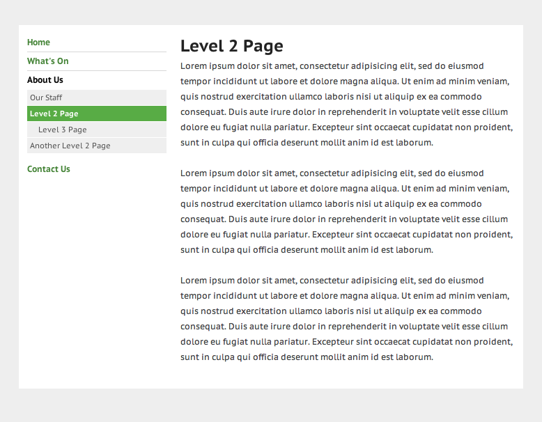

# Nested Menu Module

## Introduction

A SilverStripe module which adds template functions for a nested SiteTree menu.

The module will add the methods **NestedMenu** and **HasNestedMenu** to
the SiteTree class via extension and and makes those methods available in the templates.

This decorator also adds a checkbox field (ShowChildrenInMenus) to the CMS admin interface
to allow CMS users to hide all of the sub-pages of a page from the nested menu.

## Screenshots

## Requirements

*  SilverStripe 2.4

## Installation

* Put the module into your SilverStripe installation
* Add the additional field by visiting `http://<yoursite>/dev/build`

## Usage

### Add menu to template

In your template:

	$NestedMenu

Which will output HTML in the form:

	<ul class="nested-menu nested-menu-level-1 nested-menu-nesting-1">
	  <li class="first link"><a class="first link" href="/">Home</a></li>
	  <li class="current open"><a class="current open" href="/about-us/">About Us</a>
	    <ul class="nested-menu-level-2 nested-menu-nesting-2"><li class="first link">
	      <li class="first link"><a class="first link" href="/about-us/our-staff/">Our Staff</a></li>
	      <li class="last link"><a class="last link" href="/about-us/another-page/">Another Page</a></li>
	    </ul>
	  </li>
	  <li class="last link"><a class="last link" href="/contact-us/">Contact Us</a></li>
	</ul>

The HTML puts classes on both the list item and the anchor to aid styling.
The nested-menu class will always be put on ONLY the outer ul

You can also start at a sub level (good for when you have a horizontal top-level nav) by
calling NestedMenu with a parameter indicating the level to start at:

	$NestedMenu(2)

You can limit the maximum depth of the nesting by specifying a second parameter:

	$NestedMenu(1,3)

You can also use HasNestedMenu to include additional markup if a menu is available, e.g:

	<% if HasNestedMenu(2) %>
	  <nav id="secondary-navigation">
	    <h4>In this section&hellip;</h4>
	    $NestedMenu(2)
	  </nav>
	<% end_if %>

### Style with CSS

No CSS is currently included in this module.